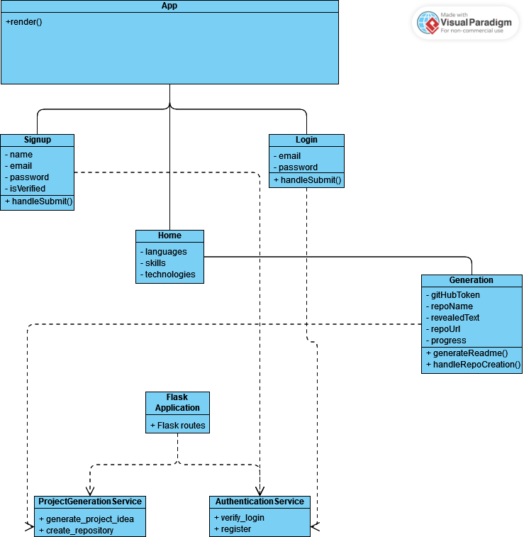

# Project Helper: Software Requirements Specification (SRS) Overview

## Introduction

The Project Helper is a comprehensive tool designed to facilitate learning and skill development by generating tailored project ideas based on user input. This README provides an overview of the system architecture as outlined in the Software Requirements Specification (SRS) document and includes a visual representation through a class diagram.

## Software Overview

- **Version**: 1.0 approved
- **Preparation Date**: 02-29-2024
- **Authors**: Zachary Freeman, Aide Cuevas, Donavan Drouin

The Project Helper aims to bridge the gap between the desire to learn new skills and finding practical applications for those skills. It supports continuous learning and skill development by aligning project suggestions with personal or professional growth objectives.

## System Architecture

The architecture of the Project Helper is designed to be intuitive and scalable, ensuring a seamless user experience while providing robust backend support for generating project ideas and managing user interactions. Below is the class diagram representing the system's architecture:

# System Statechart Diagram
The System Statechart Diagram for Project Helper shows the transitions that you will go through to register or log in to your account and generating a project. 

# Application Components Overview

## Frontend Components (React)

### App
- **Description**: Root component of the React application that sets up routing logic using `BrowserRouter` and `Routes`. It defines the navigation structure and controls the rendering of different components based on the URL path accessed by the user.

### Signup
- **Description**: Handles user registration. Provides a form for users to enter their name, email, password, and verification status. Interacts with the backend's `/register` endpoint to create a new user account and navigates the user to the login page upon successful registration.

### Login
- **Description**: Manages user login. Includes a form for users to input their email and password. Sends form data to the backend's `/login` endpoint to authenticate the user. Redirects the user to the home page upon successful authentication.

### Home
- **Description**: Serves as the landing page once the user is logged in. It may also include functionality to navigate to other parts of the application, such as a project idea generator. Passes user preferences or inputs to the `Generation` component through navigation states.

### Generation
- **Description**: Responsible for generating project ideas based on user inputs. Makes requests to backend endpoints (`/generate` for generating project READMEs and `/create-repo` for creating a GitHub repository) to perform these operations. Displays the generated README and provides functionality to create a repository based on this content.

## Backend Services (Flask)

### ProjectGenerationService
- **Description**: Interfaces with the OpenAI API to generate detailed project READMEs. Takes programming language, skills, and technologies as inputs and returns a formatted README text. Also handles the creation of GitHub repositories using user-provided GitHub tokens and project details.

### AuthenticationService
- **Description**: Manages user authentication and registration. Interacts with a MongoDB database to store user information and validate credentials during login. Ensures that user information is securely handled, using bcrypt for password hashing and validation.

## Utility and Middleware

### CORS (Cross-Origin Resource Sharing)
- **Description**: Enabled in the Flask app to allow or restrict resources to be requested from domains outside the domain from which the first resource was served. This is crucial for a web application where the frontend and backend are hosted separately.

### Flask App (`app`)
- **Description**: The main Flask application object that routes HTTP requests to appropriate handler functions based on the URL endpoint accessed. It also sets up middleware like CORS and configures the environment settings.

## Getting Started

To get started with the Project Helper, users can sign up via the landing page, providing basic information such as name, email, and desired learning areas. The system then guides the user through generating project ideas and accessing resources to support project completion.

## Contributions

We welcome contributions from the community. If you're interested in contributing, please fork the repository and submit a pull request with your proposed changes.
