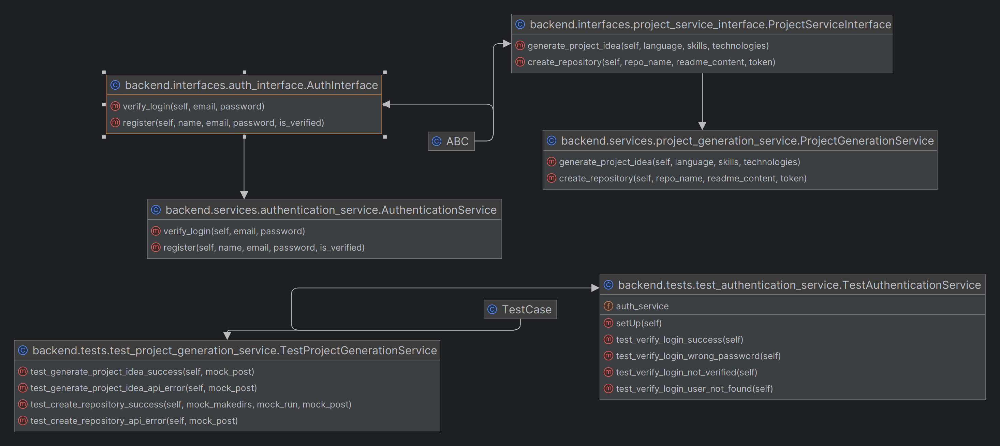

# Backend Python Code

This directory contains the Python code for the backend of the application. The backend is responsible for handling server-side logic, interacting with databases, and providing APIs for the frontend to consume.

# Class Diagram

## Requirements

- Python 3.x
- Additional libraries based on project requirements

## Installation

1. Clone the repository:

git clone https://github.com/your-repo/your-project.git

2. Navigate to the backend services directory:

cd ProjectHelper/backend

4. Install the required dependencies:

pip install -r requirements.txt

## Running the Server

To start the backend server, run the following commands:

python -m backend.services.authentication_service

python -m backend.services.project_generation_service

## API Endpoints

The backend provides the following API endpoints:

- `POST /api/register`: Sends a registration request and saves the login info to MongoDB
- `POST /api/login`: Allows the user to login
- `POST /api/generation`: Generates the README.md for the user to use
- `POST /api/create-repo`: Creates the github repo for user

For more details on the API endpoints and their request/response formats, refer to the API documentation.

## Database

The backend uses a MongoDB database to store logins for signups, and allow the user to login

## Testing

To run the test suite, execute the following command:

python -m unittest discover tests

This will run all the test cases located in the `tests` directory.

## Contributing

If you want to contribute to the project, please follow these steps:

1. Fork the repository
2. Create a new branch for your feature or bug fix
3. Make your changes and commit them with descriptive commit messages
4. Push your changes to your forked repository
5. Create a pull request to the main repository

Please ensure that your code follows the project's coding style and that all tests pass before submitting a pull request.
